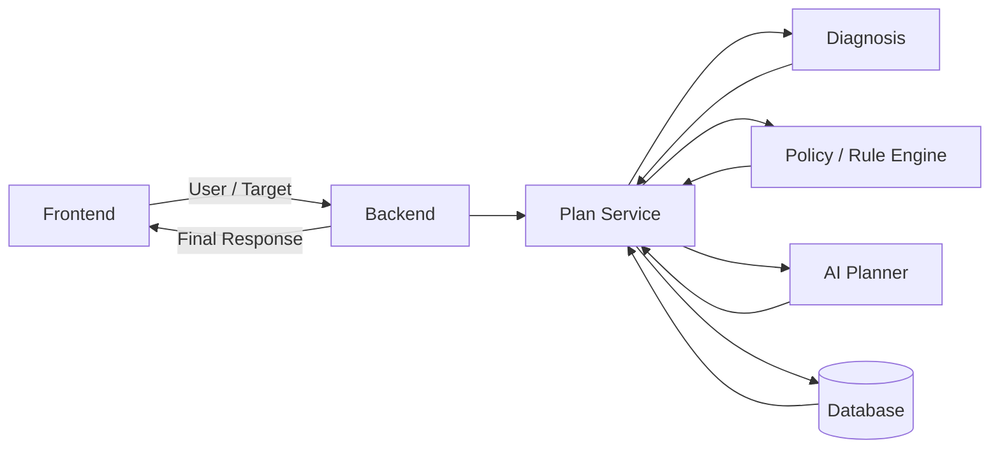

# StepHome
> 첫 독립까지, 한 걸음씩.
> 
## Overview

> **첫 독립을 준비하는 청년의 현재 상태와 목표를 진단하고, 이용 가능한 주거·자립 정책을 실제 행동 계획까지 연결하는 개인화 독립 플래너**

첫 독립을 준비할 때는 현재 자금 상태를 파악하는 것부터 주거비를 설정하고, 받을 수 있는 지원 정책을 찾고, 실제로 무엇부터 해야 하는지 정하는 과정까지 여러 정보와 판단이 필요합니다.

**StepHome**는 사용자의 현재 경제 상황과 독립 목표를 바탕으로 독립 준비도를 진단하고, 조건에 맞는 정책을 판정한 뒤, 그 결과를 실행 가능한 **Action Plan**으로 제공합니다.

정책 자격 여부와 금액처럼 정확성이 필요한 영역은 AI가 임의로 판단하지 않습니다.

- **Diagnosis**: 명시적인 계산 로직으로 독립 준비 상태 진단
- **Policy / Rule Engine**: 정책 조건을 기준으로 자격 여부 판정
- **AI**: 계산·판정 결과를 바탕으로 설명과 Action Plan 생성

---

## Core Features

### 1. 독립 조건 입력

사용자의 현재 상태와 독립 목표를 입력받습니다.

전체 데이터 모델에는 확장 필드가 포함되지만, 이번 MVP 초기 화면은 `docs/mvp-scope.md`의 P0 11개 입력값만 받습니다.

- 나이 / 현재 지역 / 직업·고용 상태
- 현재 거주 형태
- 월 소득 / 생활비 / 고정비 / 저축
- 보유 자금 / 비상 자금 / 부채
- 목표 독립일
- 희망 지역
- 월세·전세 등 희망 주거 형태
- 보증금 / 월 주거비
- 선호 주거 조건

### 2. 독립 준비도 진단

입력값을 기반으로 독립에 필요한 자금과 현재 준비 상태를 계산합니다.

주요 결과 예시:

- 독립 준비도
- 필요 초기 자금
- 초기 자금 부족액
- 목표 비상 자금
- 비상 자금 부족액
- 필요 월 저축액
- 예상 준비 기간

### 3. 정책 매칭

Policy / Rule Engine이 사용자 조건과 정책 자격 조건을 비교합니다.

정책은 다음과 같은 상태로 구분합니다.

- `AVAILABLE` — 현재 이용 가능
- `CONDITIONAL` — 일부 조건 조정 시 이용 가능
- 그 외 미충족 상태

### 4. AI Action Plan

Diagnosis와 Policy Matching 결과를 바탕으로 AI가 사용자가 실제로 수행할 행동을 우선순위별로 정리합니다.

Action 예시:

- `SAVING` — 자금 및 저축 계획
- `POLICY` — 지원 정책 확인·신청
- `HOUSING` — 주거 조건 탐색·조정
- `CONTRACT` — 계약 전 확인 사항

### 5. Re-planning

사용자가 독립 조건을 변경하면 Diagnosis와 Policy Matching을 다시 수행하고 새로운 Action Plan을 생성합니다.

예:

```text
희망 보증금
5,000,000원 → 4,000,000원

↓ Re-planning

필요 초기자금 감소
필요 월 저축액 감소
예상 준비기간 단축
일부 정책 자격 상태 변경
Action Plan 재생성
```

---

## Architecture



### Data Flow

```text
Frontend
   │
   │ User + Target
   ▼
Backend
   │
   ├── Plan Service
   │
   ├── Diagnosis
   │
   ├── Policy / Rule Engine
   │
   └── AI Planner
   │
   ▼
Final Response
   │
   ▼
Frontend
```

---

## Tech Stack

### Frontend

| 영역 | 기술 | 역할 |
| --- | --- | --- |
| Framework | React | 전체 UI |
| Language | TypeScript | API·정책·입력 데이터 타입 안정성 |
| Build | Vite | 개발 서버 및 빌드 |
| Styling | Tailwind CSS | 빠른 UI 구현 |
| Server State | TanStack Query | API 요청·로딩·에러·캐시 |
| Client State | Zustand | 입력 Draft 및 Demo 상태 |
| API Client | Native Fetch Wrapper | Backend REST API 통신 |
| Test | Vitest | 비용 계산·변환 로직 테스트 |

### Backend

| 영역 | 기술 | 역할 |
| --- | --- | --- |
| Language | Python 3.12 | Backend 전체 개발 언어 |
| Framework | FastAPI | REST API 구현 및 Frontend·Policy·AI 연결 |
| Data Validation | Pydantic | Request / Response JSON Schema 및 입력값 검증 |
| Persistence | InMemoryDatabase | MVP 데모용 계획 저장 및 Re-planning 조회 |
| ORM / DB | SQLAlchemy / SQLite | 배포·영속 저장 확장 시 도입 예정 |
| Server | Uvicorn | FastAPI 애플리케이션 실행 |
| HTTP Client | httpx | 외부 API 및 필요 시 서비스 간 HTTP 통신 |
| Environment | python-dotenv | `.env` 기반 API Key·DB 설정 등 환경변수 관리 |
| Package Manager | pip + requirements.txt | Python 패키지 및 의존성 관리 |
| API Docs / Test | FastAPI Swagger | `/docs`에서 API 명세 확인 및 직접 요청 테스트 |

현재 MVP는 FastAPI 프로세스 안의 InMemoryDatabase로 계획을 저장합니다.
서버를 재시작하면 생성된 계획은 초기화되며, 배포 환경에서는 SQLite/PostgreSQL 등 영속 저장소로 확장할 수 있습니다.

### Policy / Rule Engine

- 정형 정책 데이터 관리
- 사용자 조건과 정책 조건 비교
- 정책 자격 상태 판정
- Diagnosis 결과와 정책 결과를 Backend / AI에 전달

### AI

- Diagnosis 및 Policy Matching 결과 해석
- 사용자 상황 설명
- 우선순위 기반 Action Plan 생성
- Re-planning 결과에 따른 Action Plan 재생성

---

## Repository Structure

```text
2morrow/
├── frontend/
│   ├── src/
│   ├── package.json
│   └── vite.config.ts
│
├── backend/
│   ├── app/
│   │   ├── diagnosis/
│   │   ├── policy/
│   │   ├── ai/
│   │   ├── services/
│   │   └── routers/
│   └── requirements.txt
│
├── mock/
│   ├── request-user-target.json
│   ├── diagnosis.json
│   ├── policy-match.json
│   ├── ai-input.json
│   ├── action-plan.json
│   ├── final-response.json
│   ├── replan-request.json
│   ├── replan-final-response.json
│   ├── loading.json
│   ├── error.json
│   └── errors/
│
├── docs/
│   ├── api.md
│   ├── architecture.md
│   ├── data-contract.md
│   ├── diagnosis-rules.md
│   ├── mock-contract.md
│   ├── mvp-scope.md
│   └── user-flow.md
│
└── README.md
```

> 계약과 설명 문서는 `docs/`, 실제 테스트 데이터는 `mock/`에서 관리합니다.

---

## Mock-first Development

각 파트는 Backend 전체 구현이 끝날 때까지 기다리지 않고 **공통 Mock을 기준으로 병렬 개발**합니다.

```text
Frontend
Mock JSON → UI 구현

Backend
Mock Input → API 구현

Policy / Rule Engine
Mock User + Diagnosis → 정책 판정 구현

AI
Mock AI Input → Action Plan 구현
```

E2E 연결 단계에서는 Mock을 실제 API 호출로 교체합니다.

### Mock Files

| 파일 | 사용 목적 |
| --- | --- |
| `request-user-target.json` | Frontend → Backend 최초 입력 |
| `diagnosis.json` | Backend Diagnosis 결과 |
| `policy-match.json` | Policy / Rule Engine 판정 결과 |
| `ai-input.json` | Backend → AI 입력 |
| `action-plan.json` | AI → Backend 출력 |
| `final-response.json` | Backend → Frontend 최종 응답 |
| `replan-request.json` | Re-planning 요청 |
| `replan-final-response.json` | Re-planning 최종 결과 |
| `loading.json` | Frontend Loading UI |
| `error.json` | 공통 Error 응답 |

---

## API

### Base URL

개발 환경:

```text
http://localhost:8000
```

### Main Endpoints

```http
GET /api/v1/health
POST /api/v1/plan
POST /api/v1/replan
```

FastAPI Swagger:

```text
http://localhost:8000/docs
```

세부 Request / Response 구조는 `docs/`의 Contract 문서를 기준으로 관리합니다.

---

## Getting Started

### Frontend

```bash
cd frontend
npm install
npm run dev
```

Vite 개발 서버에서 Frontend를 실행합니다.

Backend 연결 전에는 `mock/final-response.json`과 `mock/replan-final-response.json`을 이용해 주요 결과 화면을 구현할 수 있습니다.

### Backend

#### 1. Backend 디렉토리로 이동

```bash
cd backend
```

#### 2. Python 가상환경 생성

```bash
python -m venv .venv
```

#### 3. 가상환경 활성화

Windows:

```bash
.venv\Scripts\activate
```

macOS / Linux:

```bash
source .venv/bin/activate
```

#### 4. 패키지 설치

```bash
pip install -r requirements.txt
```

#### 5. FastAPI 서버 실행

```bash
uvicorn app.main:app --reload
```

#### 6. 실행 확인

Local Development Base URL:

```text
http://localhost:8000
```

FastAPI Swagger:

```text
http://localhost:8000/docs
```

Health Check:

```text
http://localhost:8000/api/v1/health
```

> `localhost:8000`은 각 개발자의 로컬 환경에서 실행되는 Backend 주소입니다.  
> 다른 팀원도 Backend 코드를 받은 뒤 위 과정을 통해 자신의 컴퓨터에서 동일하게 실행할 수 있습니다.

#### 7. AI 환경변수 및 Fallback

AI Action Plan을 실제 OpenAI API로 생성하려면 프로젝트 루트의 `.env`에 다음 값을 설정합니다.

```text
OPENAI_API_KEY=<OpenAI Project API Key>
OPENAI_MODEL=gpt-5.6-terra
OPENAI_REASONING_EFFORT=low
AI_FALLBACK_ENABLED=true
```

`OPENAI_API_KEY`가 없거나 API 호출이 실패하면 기본 설정에서는 fallback Action Plan을 사용해 `/api/v1/plan` 데모 흐름을 계속 확인할 수 있습니다.
실제 LLM 생성 결과를 검증하려면 `.env.example`을 참고해 API Key를 설정하고, API Key는 Git에 커밋하지 않습니다.

#### Production

배포 이후 실제 Backend URL을 추가합니다.

```text
Production Backend URL: <배포 후 URL>
```

Frontend에서는 개발 환경과 배포 환경에 따라 Backend Base URL을 구분하여 사용합니다.

---

## Team

| 이름 | 역할 |
| --- | --- |
| 하은총 | Team Lead / Backend |
| 권나현 | Product / Planning |
| 박채린 | AI / LLM |
| 원서우 | Data / Policy / Eligibility |
| 조윤재 | Frontend / UX |

---

## Collaboration

### 공통 기준

- 모든 파트는 동일한 **Data Contract와 Mock**을 기준으로 개발합니다.
- API 또는 데이터 필드 변경 시 관련 `docs/`와 `mock/`을 함께 수정합니다.
- Frontend는 Backend 구현을 기다리지 않고 Mock 기반으로 먼저 개발합니다.
- E2E 연결 시 Mock 데이터와 실제 API Response 구조가 동일한지 확인합니다.
- 정책 자격 판정 및 계산 로직과 AI 생성 영역을 분리합니다.

### Contract 변경 시

```text
필드 추가 / 삭제 / 이름 변경
        ↓
Data Contract 확인
        ↓
Mock 수정
        ↓
각 파트 타입·Schema 반영
        ↓
E2E 확인
```

---

## Demo Flow

대표 Demo 흐름:

```text
1. 사용자 독립 조건 입력
        ↓
2. 독립 준비도 Diagnosis
        ↓
3. 이용 가능한 정책 Matching
        ↓
4. 개인화 Action Plan 생성
        ↓
5. 사용자가 독립 조건 변경
        ↓
6. Re-planning
        ↓
7. 변경 전 / 후 결과 비교
```

대표 Re-planning 시나리오:

```text
희망 보증금 5,000,000원
        ↓
4,000,000원으로 조정
        ↓
Diagnosis 재계산
        ↓
Policy 재판정
        ↓
Action Plan 재생성
```

---

## Development Status

현재 프로젝트는 해커톤 MVP를 기준으로 개발합니다.

우선순위:

1. 공통 Data Contract 및 Mock 고정
2. 파트별 핵심 기능 병렬 구현
3. Frontend Mock UI 완성
4. Backend / Policy / AI 연결
5. `/plan` E2E 연결
6. `/replan` E2E 연결
7. Demo Scenario 안정화

---

## Docs

상세 기술 명세는 루트 README에 중복 작성하지 않고 `docs/`에서 관리합니다.

```text
docs/
├── api.md
├── architecture.md
├── data-contract.md
├── diagnosis-rules.md
├── mock-contract.md
├── mvp-scope.md
└── user-flow.md
```

- **README** — 프로젝트 전체 개요와 진입점
- **API Contract** — Endpoint / Request / Response
- **Data Contract** — 공통 필드·타입·Enum·Nullable 규칙
- **Mock** — Contract를 기반으로 한 실제 테스트 JSON

---

## Project Principle

> **계산은 명시적으로, 정책 판정은 규칙 기반으로, AI는 결과를 행동으로 연결한다.**
